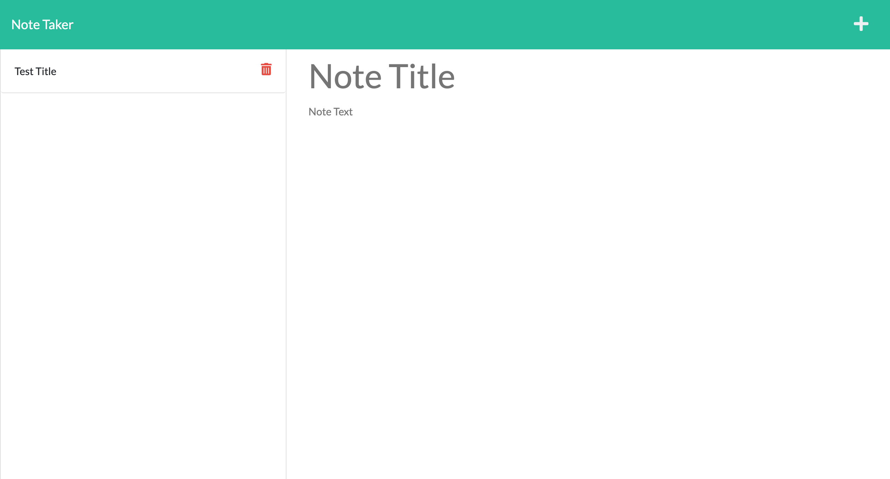

# JSON Note Taker

  [](https://opensource.org/licenses/MIT)

  ## Description
 This application allows a user to saves, delete and create notes and saves that data between rerenders. It saves the notes using a mock database powered by a JSON file containing an array of objects. It runs using Node, HTML, CSS and JS.

  ## Table of Contents

  * [Installation](#installation)

  * [Usage](#usage)

  * [Visuals](#visuals)

  * [License](#license)

  * [Deployed Links](#deployed-links)

  * [Questions](#questions)


  ## Installation

  To install necessary dependencies, run the following command:

  ```
  npm i
  ```

  ## Usage

  make sure to run ```node server.js``` to start the app.

## Visuals
  

  ## License

  This project is licensed under the MIT license.

## Deployed Links

* [The URL of the deployed project.](https://frozen-tor-69384.herokuapp.com/)

* [The URL of the GitHub repository.](https://github.com/simone188535/JSON-Note-Taker)
  ## Questions

  If you have any questions about the repo, open
  an issue or contact me directly at simone.anthony1@yahoo.com. You
  can find more of me at [simone188535](https://github.com/simone188535)
